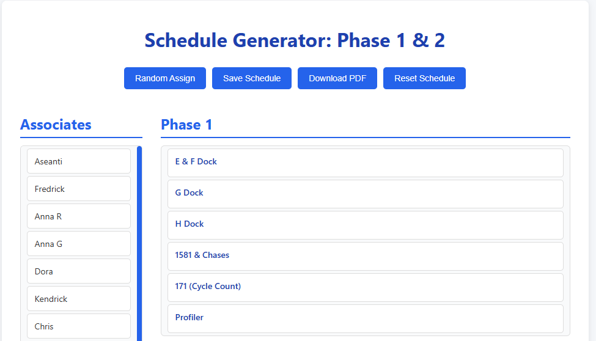

# 📅 Schedule Generator

A simple web-based schedule generator built with **HTML**, **CSS**, and **JavaScript**. This tool helps managers assign employees to weekly work shifts efficiently and visually — with either random assignment or drag-and-drop functionality.

## 🚀 Live Demo

🌐 [View Live App](https://aseantir.github.io/schedule-generator/)

## ✨ Features

- 👤 Input associate names
- 🗓️ Automatically generate weekly schedules
- 🔄 Reset button for quick schedule changes
- 📋 Optionally supports random or manual assignment
- 🎯 Built with simplicity and team needs in mind

## 📸 Screenshot

## 🛠️ Technologies Used

- HTML5
- CSS3
- JavaScript (Vanilla)

## 📁 Folder Structure

